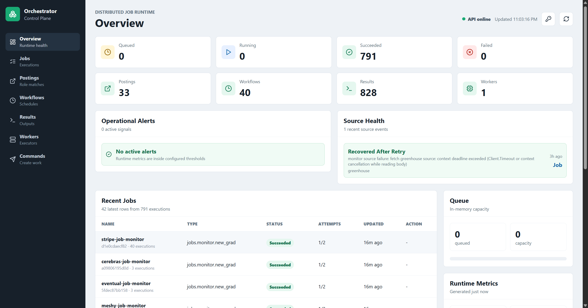
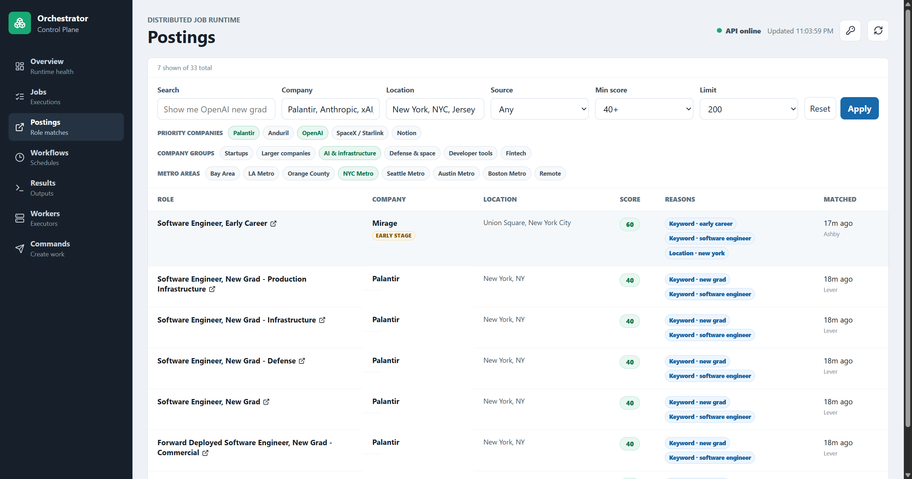
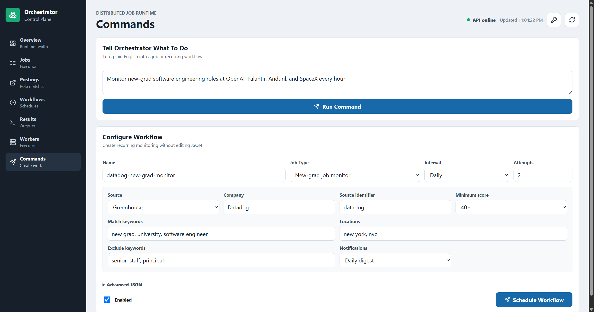
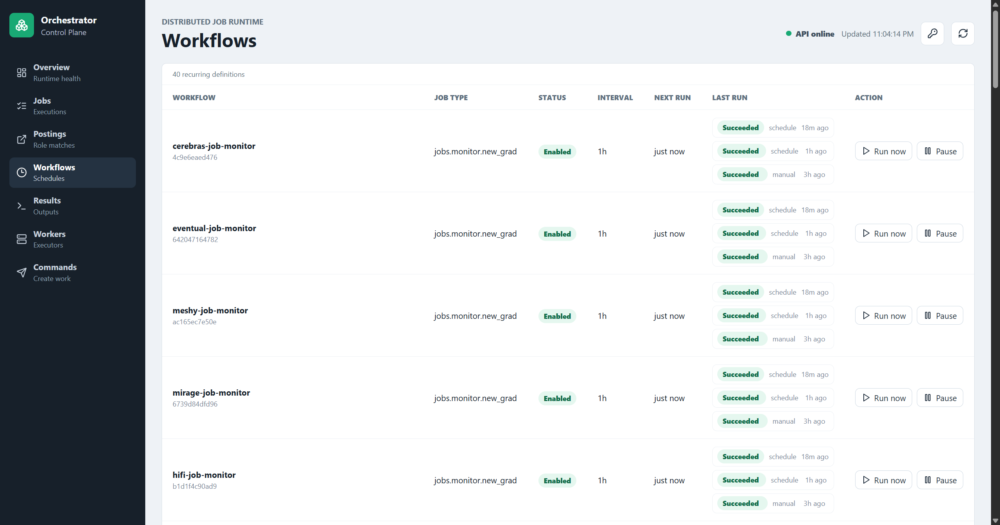

# Distributed Job Orchestrator

A Go-based job orchestration platform with a React operations dashboard, worker execution, retries, durable Postgres state, scheduled workflows, and natural-language job planning. The flagship workflow monitors public job boards for targeted new-grad software engineering roles and sends tracked email alerts when useful matches appear.

This repository is intended as a public engineering showcase and a locally runnable project. There is no hosted public API or shared compute; screenshots show the dashboard running against a local or self-hosted backend.

## Highlights

- Durable Go control plane with a job state machine, worker leases, retry/dead-letter behavior, and Postgres-backed queue mode.
- Recurring workflow scheduler with idempotent dispatch records and manual run support.
- Real product workflow for monitoring Greenhouse, Lever, Ashby, Workday, and custom job feeds.
- Live target-company monitoring for OpenAI, Palantir, Anduril, SpaceX/Starlink, Notion, and other engineering-focused companies.
- React operations dashboard for queue health, jobs, workflow runs, workers, postings, results, logs, metrics, and alerts.
- Natural-language job/workflow planning when an operator supplies their own `OPENAI_API_KEY`.
- Idempotent natural-language scheduling that reuses an equivalent workflow instead of creating duplicates.
- Tracked SMTP delivery with configurable recipients and persisted success/failure state.
- Automated backend tests, Postgres integration coverage, frontend type-checking, and production builds.

## Product Tour

[Watch the 64-second product demo](docs/demo/orchestrator-demo.mp4) to see live filtering, natural-language workflow creation, and workflow lifecycle controls.

Try commands such as `Monitor new-grad software engineering roles at OpenAI, Palantir, Anduril, and SpaceX every hour.` Equivalent requests reuse the existing workflow instead of creating duplicates.

| Runtime overview | Matched job postings |
| --- | --- |
|  |  |

| Natural-language commands | Scheduled workflows |
| --- | --- |
|  |  |

## What It Does

- Accepts immediate jobs and recurring workflow definitions.
- Converts English requests into structured jobs or workflows when `OPENAI_API_KEY` is configured.
- Runs work through embedded or standalone workers with retries, leases, and dead-letter handling.
- Persists jobs, logs, workflows, runs, postings, results, notifications, and audit events in Postgres.
- Shows queue health, workers, logs, workflow runs, postings, results, metrics, and operational alerts in the dashboard.
- Supports deployment as a single server or as separate API, worker, and Postgres processes.

## Quick Start

This project runs locally by default. Clone it, install frontend dependencies, then run either the in-memory development stack or the Postgres-backed stack.

Install frontend dependencies once:

```bash
cd frontend
npm install
cd ..
```

Run the API and dashboard together with in-memory storage:

```bash
make dev
```

Open the dashboard at:

```text
http://localhost:5173
```

Run the production-style single-server website:

```bash
make website
```

Open:

```text
http://localhost:8080
```

For the production-like distributed stack used in the project demo:

```bash
make compose-app
```

This starts the API, a standalone worker, and Postgres. Run `make frontend` in a second terminal for the live Vite dashboard at `http://localhost:5173`.

## Common Commands

```bash
make test                 # Backend tests and frontend build
make demo                 # Seed and run a deterministic fake job monitor
make dev-postgres         # API and dashboard with local Postgres
make website-postgres     # Built dashboard served by API with Postgres
make dev-distributed      # API, dashboard, Postgres, and standalone worker
make smoke-postgres       # Postgres integration checks
make smoke-distributed    # Distributed API/worker smoke test
make check-deploy         # Validate deployment environment settings
make compose-app          # Containerized API, worker, and Postgres
make postgres-stop        # Stop local Postgres
```

For a small VPS or cloud VM deployment, see [Deploy On A Small VPS](docs/deploy-vps.md).

## Configuration

For local development, copy `.env.example` to `.env` and fill in only the values you need. `make dev`, `make backend`, and `make website` load `.env` automatically.

Authentication:

```bash
ORCH_AUTH_TOKEN=replace-with-a-long-random-token make website-postgres
```

`ORCH_AUTH_TOKEN` protects dashboard API calls and operational endpoints under `/v1` and `/metrics`. API clients can send either `Authorization: Bearer <token>` or `X-Orchestrator-Token: <token>`. Health and readiness checks remain public for deployment probes.

Scoped API keys are also supported:

```bash
ORCH_API_KEYS='dashboard:long-random-token:read+write+metrics;prometheus:metrics-token:metrics'
```

Supported scopes are `read`, `write`, `metrics`, and `admin`. `ORCH_AUTH_TOKEN` remains supported and is treated as an admin key.

Natural-language commands:

```bash
OPENAI_API_KEY=sk-... make website
```

The backend uses `ORCH_OPENAI_MODEL=gpt-5.4-nano` by default. Without `OPENAI_API_KEY`, structured job and workflow submission still works.

Email delivery:

```bash
ORCH_SMTP_HOST=smtp.example.com \
ORCH_SMTP_PORT=587 \
ORCH_SMTP_USERNAME=apikey-or-user \
ORCH_SMTP_PASSWORD=secret \
ORCH_SMTP_FROM=orchestrator@example.com \
ORCH_DEFAULT_RECIPIENTS=you@example.com \
make website
```

If `ORCH_SMTP_HOST` is not set, email delivery is simulated for local development.

## Job Monitoring

Run the deterministic demo while the backend is running on `:8080`:

```bash
make demo
```

Seed recurring real-company monitors:

```bash
make seed-job-monitors
```

The seed script creates hourly `jobs.monitor.new_grad` workflows using supported public ATS APIs. Override the target API or schedule interval when needed:

```bash
ORCH_MONITOR_URL=http://localhost:8080 ORCH_MONITOR_INTERVAL_SECONDS=86400 make seed-job-monitors
```

See [Job Types](docs/job-types.md) for supported executors, payload examples, notification settings, and monitor sources.

## Architecture

```text
Dashboard / API clients
        |
        v
Go HTTP control plane
        |
        +--> Jobs store and queue
        +--> Workflow definitions and run history
        +--> Posting/result/notification stores
        +--> Worker registry and metrics
        |
        v
Scheduler creates due jobs
        |
        v
Workers claim jobs with leases
        |
        v
Typed executors store results and send notifications
```

For deeper architecture notes, see [System Design](docs/system-design.md). For project positioning and future direction, see [Project Framing](docs/project-framing.md).

## API And Dashboard

Representative endpoints:

- `POST /v1/commands/natural`: create or reuse an immediate job or recurring workflow from English.
- `POST /v1/jobs`: submit an immediate job.
- `POST /v1/workflows`: create a recurring workflow.
- `PATCH /v1/workflows/{id}`: enable or pause a workflow.
- `DELETE /v1/workflows/{id}`: safely delete a paused workflow.
- `POST /v1/workflows/{id}/run`: manually trigger a workflow.
- `GET /v1/jobs`, `GET /v1/workflow-runs`, `GET /v1/postings`, `GET /v1/results`: inspect state.
- `GET /v1/workers`, `GET /v1/metrics`, `GET /metrics`: inspect runtime and Prometheus metrics.
- `GET /healthz`, `GET /readyz`: process and dependency health checks.

Collection endpoints support pagination with `limit` and `offset`, or `page_size` and `page`. In Postgres mode, filters and pagination are pushed into SQL for jobs, postings, workflow runs, and results.

Backend-specific API notes are in [backend/README.md](backend/README.md). Frontend-specific notes are in [frontend/README.md](frontend/README.md).
