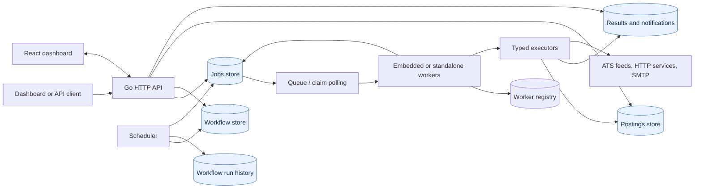

# System Design

This project is a concrete distributed job orchestrator with job-posting monitoring as the flagship workflow. Use this guide to explain the design in an interview without hand-waving past the hard parts.

## Product Framing

The system lets a user define recurring or one-off work, execute it through workers, persist execution history, and alert on useful results. The primary workflow is monitoring company job boards for new-grad SWE roles and notifying the user when new matching postings appear.

Core user flows:

- Create a recurring monitor workflow from structured JSON or natural language.
- Run the workflow now or wait for the scheduler to dispatch it.
- Fetch external job-board feeds, normalize postings, score matches, and dedupe results.
- Send an immediate alert only when new matching postings are discovered.
- Inspect jobs, runs, postings, results, workers, queue state, logs, and metrics from the dashboard or API.

## Requirements

Functional requirements:

- Submit immediate jobs and recurring workflows.
- Persist jobs, workflow definitions, workflow runs, postings, results, logs, and worker state.
- Support multiple worker processes against a shared durable queue.
- Retry transient failures and preserve terminal failure state.
- Deduplicate scheduled dispatches and discovered postings.
- Expose operational status through health checks, readiness checks, metrics, and dashboard views.

Non-functional requirements:

- At-least-once execution with idempotent job handlers where side effects matter.
- Horizontal worker scaling.
- Restart-safe scheduling and execution state.
- Bounded queue pressure in local mode, durable store-backed queue in Postgres mode.
- Clear audit history for each scheduled workflow run.
- Observable failure modes for stuck workers, expired leases, retries, and dead-lettered jobs.

## Architecture



The stores are in memory for local development or PostgreSQL for durable deployments.
In PostgreSQL mode, workers claim queued rows directly from the jobs table; there is
no separate broker. The scheduler creates ordinary jobs from recurring workflow
definitions. Workers run them through the same executor path as immediate jobs.

### Job execution and recovery

```mermaid
sequenceDiagram
    participant S as Scheduler or API
    participant J as Jobs store
    participant Q as Queue / claim loop
    participant W as Worker
    participant X as Executor
    participant R as Lease reclaimer

    S->>J: Create job (queued)
    S->>Q: Enqueue job ID (memory mode)
    Q->>J: Claim queued job
    Note over J: Atomic queued → running; attempts + 1; owner and lease deadline set
    J-->>W: Claimed job
    W->>X: Execute
    alt Executor succeeds
        X-->>W: Success
        W->>J: Mark succeeded; clear lease
    else Executor fails and attempts remain
        X-->>W: Error
        W->>J: Mark queued; record error in log
        W->>Q: Enqueue for another attempt
    else Executor fails on final attempt
        X-->>W: Error
        W->>J: Mark dead letter
    end
    loop Every lease sweep interval
        R->>J: Find running jobs whose lease expired
        alt Attempts remain
            J-->>R: Set queued; clear lease
            R->>Q: Re-enqueue (memory mode)
        else Attempts exhausted
            J-->>R: Set dead letter
        end
    end
```

Important implementation boundaries:

- `backend/internal/api`: public HTTP routes and JSON contracts.
- `backend/internal/jobs`: job state machine, logs, queue abstraction, lease recovery.
- `backend/internal/scheduler`: recurring workflow dispatch with idempotency keys.
- `backend/internal/worker`: worker pool and typed job execution.
- `backend/internal/monitor`: Greenhouse, Lever, Ashby, and fake monitor sources.
- `backend/internal/postings`: normalized posting store with dedupe.
- `backend/internal/results`: structured execution outputs.
- `backend/internal/workflows` and `backend/internal/workflowruns`: scheduled workflow definitions and run history.

## API Surface

Representative endpoints:

- `POST /v1/jobs`: submit one immediate job.
- `GET /v1/jobs`, `GET /v1/jobs/{id}`: inspect executions and logs.
- `POST /v1/jobs/{id}/cancel`: cancel queued work.
- `POST /v1/jobs/{id}/retry`: retry terminal jobs.
- `POST /v1/workflows`: create a recurring workflow.
- `POST /v1/workflows/{id}/run`: manually trigger a workflow.
- `GET /v1/workflow-runs`: inspect scheduled/manual workflow executions.
- `GET /v1/postings`: view matched job postings.
- `GET /v1/results`: view structured job outputs.
- `GET /v1/workers`: inspect worker liveness and current jobs.
- `GET /v1/metrics` and `GET /metrics`: JSON and Prometheus-compatible metrics.
- `GET /healthz` and `GET /readyz`: process and dependency health.

## Data Model

Key entities:

- `jobs`: execution unit with type, payload, status, attempts, lease owner, lease deadline, timestamps, metadata.
- `job_logs`: append-only execution messages tied to a job.
- `workflows`: recurring definitions with job type, payload, interval, enabled state, and next run timestamp.
- `workflow_runs`: audit record for every workflow dispatch, including trigger, job ID, scheduled timestamp, and idempotency key.
- `postings`: normalized external job postings with source identity, dedupe key, match score, and first/last seen timestamps.
- `results`: structured outputs such as monitor summaries and HTTP response summaries.
- `audit.event` results: durable operator/action audit records for job and workflow mutations.
- `workers`: worker heartbeat, status, and current job.

Indexes support common access paths: status lookup, created-time sorting, due workflows, workflow/job run lookup, posting source/time lookup, and unique workflow-run idempotency.

## Queue Semantics

The system supports two queue modes:

- In-memory queue for fast throwaway local development.
- Store-backed queue in Postgres mode so API and worker processes share durable state.

Execution semantics are at least once:

- A worker claims a queued job and marks it running with a lease.
- Successful jobs transition to `succeeded`.
- Failed jobs retry until `max_attempts`, then move to `dead_letter`.
- If a worker dies, the lease reclaimer finds expired running jobs and either requeues or dead-letters them.

This is the right default for an orchestrator because exactly-once execution is not realistic across process crashes and external side effects. Instead, handlers should be idempotent. The job monitor does this by deduping postings before alerting.

## Scheduler Semantics

Recurring workflow definitions are not jobs. The scheduler periodically checks enabled workflows whose `next_run_at` is due and creates a normal queued job.

Reliability properties:

- Workflow definitions persist across process restarts.
- A scheduled run records `scheduled_for`, `trigger`, `job_id`, and status.
- Dispatch idempotency uses `workflow_id + scheduled_for`, preventing duplicate run records for the same scheduled time.
- Manual `Run now` uses the same worker execution path as scheduled runs.

## Job Monitor Design

Monitor jobs fetch public ATS feeds and normalize them into candidate postings.

Supported sources:

- Greenhouse: `board_token`
- Lever: `account_name`
- Ashby: `job_board_name`
- SmartRecruiters: `company_identifier`
- Workday: `tenant` and `site`, or a direct `api_url`
- Custom JSON careers feeds: `url`
- Fake source for deterministic demos and tests

Per-source fetch settings support polite monitoring and outage recovery: `rate_limit_ms`, `max_retries`, and `backoff_ms`.

Matching is deliberately explainable:

- Company match adds score.
- Keyword match adds score.
- Location match adds score.
- Excluded keywords reject a candidate.
- `min_score` controls alert sensitivity.

Alerts are sent only when the monitor creates at least one new matching posting. Re-seeing an existing posting updates its record without sending another immediate alert.

Alert preferences support immediate mode, digest-only mode, quiet hours, timezone selection, and a max-alerts-per-workflow guard. Workflow ownership is stored in metadata, and mutating API calls create `audit.event` result records with action, actor, path, linked workflow/job IDs, and action-specific data.

## Observability

Dashboard and API observability cover:

- Queue depth, capacity, and utilization.
- Jobs by status, attempts, retry attempts, leases, and expired leases.
- Worker count, active workers, running workers, heartbeat age, and current job.
- Workflow totals, enabled workflows, due workflows, and run counts.
- Posting and result counts.
- Per-job logs and structured result records.
- Prometheus-compatible metrics for external dashboards.

In an interview, call out what each signal answers:

- Queue depth answers "are we falling behind?"
- Leased and expired leases answer "are workers stuck or crashing?"
- Dead letters answer "which jobs need operator or code intervention?"
- Workflow due count answers "is scheduling blocked?"
- Posting/result totals answer "is the product workflow producing useful output?"

## Scaling Strategy

Start simple:

- One API process with embedded workers.
- Postgres for durable state.
- Dashboard served by the API or Vite in development.

Scale execution:

- Disable embedded workers with `ORCH_EMBEDDED_WORKERS=false`.
- Run multiple `cmd/worker` processes against the same Postgres database.
- Increase `ORCH_WORKERS` per worker process for more concurrency.

Scale the queue:

- Postgres-backed claiming is sufficient for low-to-moderate volume and strong simplicity.
- For higher throughput, introduce Redis, SQS, or Kafka behind the existing queue interface.
- Preserve the job state machine in Postgres as the source of truth for auditability.

Scale reads:

- Add pagination and filters to list endpoints.
- Add compound indexes for dashboard queries.
- Move high-cardinality logs or metrics to purpose-built stores if needed.

Scale external fetching:

- Add per-source rate limits and backoff.
- Partition workflows by company/source.
- Cache source fetches if many workflows overlap.
- Add source-specific adapters for Workday and custom career pages.

## Failure Modes And Mitigations

- API restarts: workflows and jobs persist in Postgres; scheduler resumes on startup.
- Worker crash mid-job: lease expires; reclaimer requeues or dead-letters based on retry budget.
- Duplicate scheduler tick: idempotency key prevents duplicate scheduled run records.
- External ATS outage: job fails and retries; terminal failure is visible in logs and dead-letter status.
- Email provider outage: alert send failure fails the job, allowing retry.
- Duplicate posting from source: posting dedupe prevents repeat immediate alerts.
- Bad payload: validation and typed executor errors surface in job status/logs.

## Security And Safety

Current safety boundaries:

- Structured job payloads instead of arbitrary code execution for the monitor workflow.
- SMTP credentials and API keys come from environment variables.
- Health/readiness endpoints avoid exposing secrets.
- Static job source adapters reduce scraping risk compared with arbitrary browser automation.

Future hardening:

- Authentication and authorization for API/dashboard access.
- Secret storage through a provider instead of local `.env`.
- Per-job timeout and cancellation policies by type.
- Egress allowlists for HTTP request jobs.
- Audit log for operator actions like cancel, retry, enable, and disable.

## Tradeoffs

Postgres queue vs dedicated queue:

- Postgres keeps the MVP simpler and strongly auditable.
- Dedicated queues improve throughput, delayed delivery, fanout, and operational separation.
- The existing queue interface gives a clean migration path.

Polling scheduler vs event-driven scheduler:

- Polling is simple, restart-safe, and adequate for minute-level workflows.
- A distributed scheduler with leader election is better for high scale or sub-second precision.
- Idempotent dispatch makes polling safe enough for this product.

At-least-once vs exactly-once:

- At-least-once is realistic and recoverable.
- Exactly-once is usually an illusion once external APIs and emails are involved.
- Idempotent writes and dedupe keys provide the user-visible behavior needed here.

Simple scoring vs ML ranking:

- Rule scoring is explainable and easy to tune.
- ML ranking can improve recall, but creates more data, feedback, and evaluation requirements.
- For new-grad job alerts, simple matching is the right first version.

## Interview Narrative

Use this sequence when presenting the project:

1. Define the product: recurring job monitor plus general-purpose orchestrator.
2. State requirements: durable scheduling, at-least-once workers, retries, dedupe, alerting, observability.
3. Draw the architecture: API, stores, scheduler, queue, workers, typed executors.
4. Walk one workflow: create monitor, scheduler dispatches job, worker claims with lease, monitor fetches ATS, postings dedupe, result recorded, email sent.
5. Discuss failures: worker crash, duplicate tick, external outage, email outage, restart.
6. Discuss scaling: separate workers, queue backend migration, source partitioning, pagination/indexes.
7. Discuss tradeoffs: Postgres queue, polling scheduler, at-least-once execution, simple scoring.
8. Close with roadmap: auth, rate limiting, pagination, Workday/custom source adapters, stronger alerting rules, production deployment.

## Next Engineering Improvements

The original maturity list is implemented: auth, pagination, source backoff, Workday/custom sources, alert preferences, ownership/audit events, and VPS deployment docs are part of the system.

Current hardening areas:

- Replace private-deployment API keys with full user/session management if this becomes multi-user.
- Expand notification delivery from email-only tracking into provider-specific routing for Slack, SMS, and webhooks.
- Add migration review and release gates before applying schema changes automatically in production.
- Add source-health dashboards from `monitor.source_health` results and operational alert metrics.
- Add integration tests against a real Postgres service in CI for migrations, SQL pagination, notification delivery state, and scheduler locking.

## Stabilization Status

Stabilization coverage now includes:

- Unit tests for normal in-memory and API behavior.
- Postgres integration tests behind the `integration` build tag.
- `make smoke-postgres` for local Postgres migration, pagination, notification, and advisory-lock checks.
- CI jobs for backend tests, Postgres integration tests, frontend build, and Docker image builds.
- Dashboard visibility for operational alerts and monitor source-health failures.
